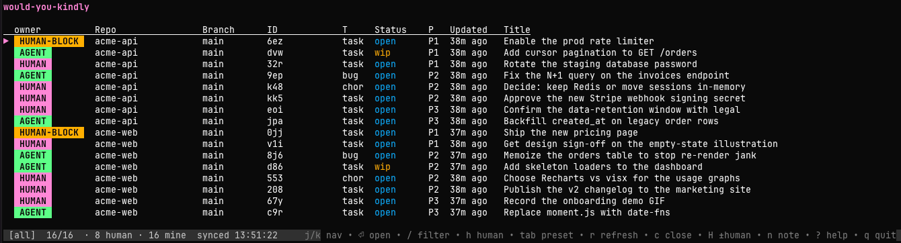

# would-you-kindly

[](https://github.com/jimbottle/would-you-kindly/actions/workflows/test.yml)

A terminal UI over the [beads](https://github.com/gastownhall/beads) issue
tracker, built for one specific moment: when an agent finishes the
mechanical part of a task and needs a human to do the part it cannot.

`wyk` (the binary) lists your bd issues, navigates them with vim keys, and
lets you press one key — `h` — to filter down to exactly the issues an
agent has flagged for your attention.

## Why

Most issue trackers assume tasks are either assigned to a person or
not. When an agent is doing most of the work, a third state matters:
"the agent has done what it can and is handing this back to a human."
`wyk` keys off a small, explicit convention (see
[`docs/CONTRACT.md`](docs/CONTRACT.md)) and gives that state its own
keystroke.

## The contract in one sentence

A task is for a human when it carries the `human` label; its
description is the runbook the human follows; `src:agent` / `src:human`
records who filed it. The full contract lives in
[`docs/CONTRACT.md`](docs/CONTRACT.md).

## Install

You'll need Go 1.26+ (matching `go.mod`) and the **`bd` (beads)** binary on
your `PATH` — wyk shells out to it for all storage. Install bd first by
following the instructions in its repo:
[github.com/gastownhall/beads](https://github.com/gastownhall/beads).

Then install wyk:

```bash
# Latest tagged release:
go install github.com/jimbottle/would-you-kindly/cmd/wyk@latest

# Or tip of main:
go install github.com/jimbottle/would-you-kindly/cmd/wyk@main
```

Or from a checkout:

```bash
go build -o ./bin/wyk ./cmd/wyk
```

First run, inside a repo (creates the beads workspace if needed, installs
the auto-close hook, and registers the repo):

```bash
bd init      # only if this repo has no .beads workspace yet
wyk init     # install the post-commit hook + register the repo
wyk doctor   # verify bd, wyk, and the hook are all wired up
```

Check what version you're running:

```bash
wyk --version
# Tagged install (go install ...@vX.Y.Z): wyk v0.5.0
# Pseudoversion (go install ...@latest):  wyk v0.5.1-0.YYYYMMDD-<sha>
# From-checkout build (go build):         wyk (devel) (commit <sha>)
```

The `(commit …)` suffix and `-dirty` marker only appear for builds
produced inside this repo's working tree — Go's module-proxy builds
don't carry VCS stamps.

## Run

After running `wyk init` in each repo you want to track, just:

```bash
wyk
```

— and the TUI shows issues from every registered repo, with a
`Repo` and `Branch` column on the left of the table. Writes (`c`,
`H`, `n`) route to the correct repo automatically. The registry
lives at `~/.config/wyk/repos.json` (or `$XDG_CONFIG_HOME/wyk/...`)
and is plain editable JSON.

For a single repo (without going through the registry):

```bash
wyk -C /path/to/repo
```

Launch into a specific preset (so a shell alias can land on the human
view, the agent inbox, etc.):

```bash
wyk -preset human    # all/ready/human/mine/blocked
```

### Managing the registry

```bash
wyk registry list             # human-readable list (-json for structured)
wyk registry remove <name>    # drop one entry by display name
wyk registry prune            # drop entries whose path or .git is gone
```

`prune` asks for `[y/N]` confirmation before writing; pass `-y` to skip
the prompt in scripts. The registry file lives at
`~/.config/wyk/repos.json` and stays editable by hand too.

If the registry is empty or has only one entry, `wyk` (no args)
falls back to running against the current directory — the v0.1.0
single-repo behaviour.

### Non-TTY one-shot

For scripts and CI:

```bash
wyk --probe
# 3 issue(s) flagged for human:
#   would-you-kindly-2oa      P1  Rotate the staging database password
#   would-you-kindly-1ej      P2  Approve the v0.3.0 release on GitHub
#   would-you-kindly-117      P3  Decide retention policy for ephemeral wisp beads
```

Exits 0 on success, 2 if bd is missing or there's no workspace, 1 on
other errors.

### Handing a task to a human (agent side)

For an agent that's just decided "this needs a human" (no bd issue
yet), file and hand off in one shot:

```bash
cat runbook.md | wyk handoff -create "Rotate staging DB password" -priority 1
# created would-you-kindly-63o — "Rotate staging DB password"
# handed would-you-kindly-63o to human (327-byte runbook)
```

For an existing issue:

```bash
cat runbook.md | wyk handoff wyk-42
# handed wyk-42 to human (327-byte runbook)
```

`wyk handoff` tags the issue with the `human` label and replaces its
description with the runbook from stdin (or `--file <path>`). With
`-create`, it runs `bd create` first (with `src:agent`) and uses the
new ID for the handoff. Same
contract as the TUI's `H` key — see
[`docs/CONTRACT.md`](docs/CONTRACT.md). Go programs can call
[`pkg/handoff.BounceToHuman`](pkg/handoff/handoff.go) directly.

### Diagnosing setup issues (`wyk doctor`)

```bash
wyk doctor
#   [PASS] bd binary on PATH
#          /Users/you/.local/bin/bd — bd version 1.0.4
#   [PASS] wyk binary on PATH
#          /Users/you/.local/bin/wyk
#   [PASS] wyk registry
#          ~/.config/wyk/repos.json — 2 repo(s) registered
#   [PASS] repo would-you-kindly: .beads/ present
#   [PASS] repo would-you-kindly: post-commit hook (chained)
#   ...
#   doctor: OK
```

Checks the common friction points: bd and wyk on `PATH`, registry
parseable, each registered repo has `.beads/` and `.git/`, post-
commit hook is either wyk's (plain or chained) or flagged as foreign,
chained hook's `.pre-wyk` preservation file is intact.

Exit 0 on PASS or WARN-only, exit 1 if any FAIL.

### Stats

```bash
wyk stats          # human-readable counts + timing across all registered repos
wyk stats -json    # structured output for scripting
```

Aggregate snapshot: issue counts by status, currently human-flagged
(split by `src:agent` vs `src:human`), agent inbox count, closures in
the last 7/30 days, and median/p95 time-to-close for human-flagged
issues. Useful as a heartbeat for the handoff loop.

### Looking up the convention (agents start here)

```bash
wyk conventions          # human-readable agent-ready tip
wyk conventions -json    # structured for programmatic ingestion
```

If you're writing code that interacts with bd in a wyk-tracked repo,
this is the first thing to run. It documents the two labels (`human`,
`src:agent`), the inbox query, the preferred handoff command, and a
concrete `bd create` example. `wyk init` also writes the same
convention into bd's `remember` store, so `bd prime` surfaces it on
every agent session start without an extra command.

### Picking up bounced-back work (agent inbox)

The other direction of the handoff loop: when a human presses `H` to
remove the `human` label, the issue lands in the agent's inbox.

```bash
wyk inbox          # human-readable list across every registered repo
wyk inbox -json    # structured output for an LLM to ingest
# > 1 issue(s) in inbox:
# >   would-you-kindly-037   P4  Configure production OAuth client
```

The canonical query is `label=src:agent AND NOT label=human AND
status!=closed` — things you (the agent) filed that a human has
touched but left open. Use this at the start of a session to find
what you need to act on next.

#### Claude Code skill

A project-local Claude Code skill at
[`.claude/skills/handoff/SKILL.md`](.claude/skills/handoff/SKILL.md)
tells any Claude session that opens this repo *when* `handoff` is the
right call and *how* to write a runbook the human can act on. The
skill is explicit about what handoff is NOT (clarifying questions,
tedious-but-doable work, quick reversible edits) — handoff is for
"I know what to do but genuinely cannot do it."

Beyond that one repo-local skill, `wyk` ships an installable family of
agent skills (`wyk`, `wyk-handoff`, `wyk-project-review`) embedded in the
binary — install them into `~/.claude/skills` with `wyk skills install`
so any Claude session loads them on demand. See
[`docs/SKILLS.md`](docs/SKILLS.md) for the full list, the install-state
model, and how they stay in sync with the CLI.

### Auto-closing issues on commit (`wyk init`)

```bash
wyk init
# wyk init: installed post-commit hook at .git/hooks/post-commit
```

After `wyk init`, every commit whose message contains a
`Closes:`, `Fixes:`, or `Resolves:` trailer (case-insensitive) auto-
closes the referenced bd issue. Hierarchical IDs work too:

```
Closes: would-you-kindly-ma5.4
Fixes #bd-42
Resolves: my-project-abc
```

**One ID per line.** A trailer listing multiple IDs (`Closes: bd-1,
bd-2`) is rejected wholesale — use two separate `Closes:` lines.
This is deliberate; it avoids closing extras from prose like
`Closes: bd-1 (we'll handle bd-2 next week)`.

If `.git/hooks/post-commit` already exists from another tool
(e.g. `roborev`, `husky`, `pre-commit`), you have three options:

- `wyk init -chain` (recommended) — preserves the existing hook
  at `post-commit.pre-wyk` and writes a wrapper that runs both:
  the original first, then wyk's auto-close. Non-destructive.
- `wyk init -force` — overwrites the existing hook entirely.
  Destructive — only use if you don't need the other tool's hook.
- `wyk init -dry-run` — preview what either path would do without
  writing anything.

To uninstall a chained install: `rm .git/hooks/post-commit` and
(optionally) `mv .git/hooks/post-commit.pre-wyk .git/hooks/post-commit`
to restore the original.

## Keys

### Reading

| Key       | Action                                            |
| --------- | ------------------------------------------------- |
| `j` / `k` | Move down / up                                    |
| `g` / `G` | Top / bottom of the list                          |
| `]` / `[` | Next / previous human-flagged issue (wraps)       |
| `enter`   | Open the selected issue (read its instructions)   |
| `esc`     | Back to the list                                  |
| `/`       | Open the fuzzy filter input (matches title + body)|
| `@name`   | Expand a saved fuzzy filter (manage via `:filter`)|
| `h`       | Jump to the human-flagged view                    |
| `tab`     | Cycle preset filters (all → ready → human → mine → blocked) |
| `C`       | Toggle "show closed" across all presets           |
| `s` / `S` | Cycle sort key / reverse the active direction     |
| `o`       | Column-visibility overlay (persists to `ui.json`) |
| `r`       | Refresh from bd now                               |
| `?`       | Open the help overlay                             |
| `q`       | Quit                                              |

### Writing

| Key   | Action                                                      |
| ----- | ----------------------------------------------------------- |
| `c`   | Close the cursor issue (asks `[y/N]` to confirm)            |
| `H`   | Toggle the `human` label on the cursor issue                |
| `n`   | Append a note to the cursor issue (multi-line textarea)     |
| `N`   | File a new issue in the cursor's repo (QuickAdd; refuses without an owner) |
| `e`   | Edit the cursor issue's description in `$EDITOR`            |
| `L`   | Toggle an arbitrary label on the cursor issue               |
| `O`   | Change the cursor issue's owner                             |
| `d`   | Defer the cursor issue (`bd update --defer`)                |
| `+`/`-` | Bump the cursor issue's priority                          |
| `v`   | Multi-select; bulk close / flag / defer the marked rows     |
| `u`   | Undo the last close (reopens via `bd reopen`; one-deep)     |
| `.`   | Repeat the last write action against the cursor row         |

### Clipboard & command palette

| Key   | Action                                                      |
| ----- | ----------------------------------------------------------- |
| `y`   | Yank the cursor row's ID                                    |
| `Y`   | Yank `ID — title`                                           |
| `*`   | Yank every visible row's ID, newline-separated              |
| `M`   | Yank the cursor row as a markdown task line (`- [ ] ID — title`) |
| `_`   | Yank every visible row as a markdown task list              |
| `:`   | Command palette — `:assign`, `:priority`, `:label`, `:filter list`/`remove`, `:bd <args>` |

After any write, the list refetches and a status banner appears
above the help bar (e.g. `closed wyk-42`, or `close wyk-42 failed: …`).

The detail view (`enter` on a row) shows the issue's full
description and any accumulated notes (added via `n` or `bd note`).
Notes lazy-load via a `bd show` call on entry, so the section
appears a beat after the rest of the detail view.

The list also refreshes itself every 10 seconds. On platforms with
fsnotify support, external `bd` writes (a `git pull`, another `wyk`
instance, the post-commit hook auto-closing) trigger an immediate
refresh instead of waiting for the next tick.

### Customizing colors

Drop a `~/.config/wyk/theme.json` (or `$XDG_CONFIG_HOME/wyk/theme.json`)
to override any subset of the built-in lipgloss styles:

```json
{
  "human_badge_bg": "#ff66cc",
  "agent_badge_bg": "78",
  "status_open":    "39"
}
```

Empty or missing keys fall through to the defaults. Colors accept ANSI
256 codes (`"212"`) or hex literals (`"#ff66cc"`). Set `NO_COLOR=1` (or
`WYK_NO_COLOR=1`) to disable styling entirely.

### Other subcommands

```bash
wyk activity [-since 24h] [-priority N] [-repo name] [-status open|closed|all] [-json]
wyk export   [-since 24h] [-compact] [-repo name]                        # JSON dump
wyk import   [-file path] [-dry-run] [-repo name]                        # restore from a dump
wyk dashboard [-json] [-days N] [-repo name]                             # per-repo rollup
wyk depgraph [-repo name] [-json]                                        # dependency tree
wyk skills   <list|install|uninstall|print>                             # agent skills for Claude Code
wyk update   [-y] [-channel any|stable] [-dry-run]                       # self-update via go install
wyk completion <bash|zsh|fish>                                           # shell completion
wyk help [--markdown]                                                    # keymap reference
wyk version [--check]                                                    # 0 current / 1 newer / 2 net err
```

The full CLI reference is generated at
[`docs/generated/cli.md`](docs/generated/cli.md) and the TUI keymap at
[`docs/generated/keymap.md`](docs/generated/keymap.md).

`wyk inbox -priority N -repo <name>` and `wyk handoff -note <text>`
extend the existing inbox/handoff commands. Every subcommand that
emits structured data accepts `-json`; the JSON shapes are stable
across patch releases.

## A day in the life

The product's whole point is the round-trip between an agent and a
human. Here's what that looks like end-to-end across two sessions.

**Morning, in your editor — an agent is doing work.** It hits
something it can't do alone (rotate a secret, click "Publish" on a
release, decide which legal entity signs a contract). It files a bd
issue and hands it off in one shot:

```bash
$ echo "1. ...  2. ...  3. Close this issue when done." \
    | wyk handoff -create "Rotate the staging DB password" -priority 1
created would-you-kindly-2oa — "Rotate the staging DB password"
handed would-you-kindly-2oa to human (87-byte runbook)
```

The agent moves on to other work. The bd issue now carries `human`,
`src:agent`, and the runbook as its description.

**Afternoon, at your terminal.** You run `wyk` (or it's already
open). Press `h` to jump to the human view:

```
Repo               Branch     ID         T     Status  P   Updated  Title
would-you-kindly   main       2oa        task  open    P1  3h ago   Rotate the staging DB password  HUMAN
acme-pipeline      feat/x     mc-42      bug   open    P0  1h ago   Latest broken                   HUMAN
```

(The `HUMAN` badge is rendered plain regardless of who filed the issue —
`src:agent` vs `src:human` is still in the row's labels, but the badge
itself stays uniform so the eye reads it as one thing.)

Press `enter` to read the runbook, `c` to close when done, or `H` to
bounce it back to the agent if the next step is theirs again. The
list refreshes every 10 seconds and across every repo you've
registered with `wyk init`.

**Next morning, in your editor.** Your agent starts a session and
checks its inbox:

```bash
$ wyk inbox -json
[
  {"id":"would-you-kindly-2oa","title":"Rotate the staging DB password",
   "labels":["src:agent"], "status":"open", ...}
]
```

These are issues the agent filed (`src:agent`) that no longer carry
`human` — i.e. you handled the runbook step, removed the label, and
now expect the agent to do the next thing. The agent picks them up,
re-applies `human` if another round is needed, or closes when fully
done.

The label flips trace the conversation. The TUI is the human's
window into it; `wyk handoff` and `wyk inbox` are the agent's.

## Screenshots



The default `all` preset across registered repos. The **owner** column
carries the "whose move is it" badge — `HUMAN` for handed-off work,
`AGENT` for issues the agent filed, `HUMAN-BLOCK` for agent issues
blocked on a human — next to the Repo / Branch / Status columns and the
`[all] · N human · M mine` status bar.

## Status

`wyk` is actively developed. See the
[CHANGELOG](CHANGELOG.md) and the
[GitHub releases](https://github.com/jimbottle/would-you-kindly/releases)
for what's shipped and when. It's a CLI-driven toolkit around the
human-in-the-loop handoff contract: the multi-repo TUI plus subcommands
(`init`, `handoff`, `inbox`, `stats`, `dashboard`, `doctor`, `registry`,
`export`, `import`, `activity`, `depgraph`, `skills`, `update`), agent
skills installable into Claude Code, a `theme.json` color overlay with
light/dark adaptation, and `NO_COLOR` support.

## License

MIT. © Raylytics LLC. See [LICENSE](LICENSE).
