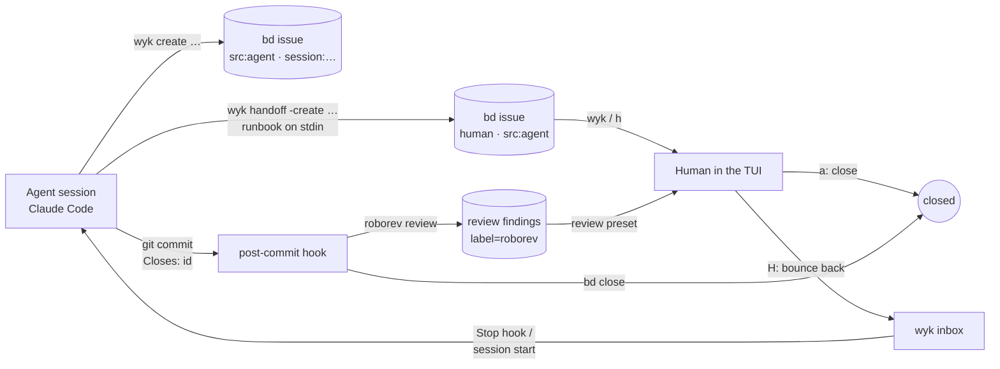

# How this repo is built: the agent ↔ human ↔ review loop

wyk exists to make one moment legible — an agent has done the mechanical
part of a task and needs a human for the part it can't do. This document
is the loop that produced wyk itself, using real issue IDs from the
tracker in this repo. Every mechanism below is one you can run in your
own repo after `wyk init`.



## 1. The agent files its own work

Agents in this repo don't keep TODO lists; they file bd issues before
touching code. `wyk create` wraps `bd create` and stamps the provenance
the rest of the loop keys off — `src:agent` and a `session:<id>` label
that becomes the TUI's **Session** column:

```
$ wyk create --title "tui: warm-start cache seeds rows from a different
  registry than the one wyk was launched against" --type=bug --priority=1
  -a jimbottle --description "…"
wyk create: created would-you-kindly-mup1 (src:agent, session:5a5b8a48)
```

That issue was filed by the agent session that wrote this document, when
regenerating the README screenshot painted a private backlog into the
capture. The rule in [`CLAUDE.md`](../CLAUDE.md) is that friction an
agent hits *using* wyk is wyk product feedback — so the bug got an
issue, a fix, and a test in the same session, and the commit that ships
it closes the issue (§4).

A `PreToolUse` hook in [`.claude/settings.json`](../.claude/settings.json)
(`wyk hook bd-create-guard`) redirects a bare `bd create` to `wyk create`
so the stamps can't be skipped by forgetting.

## 2. Handing the human-only step back

When the remaining step needs a human — a secret, a click in a
third-party UI, a decision someone is accountable for — the agent writes
the runbook *as the issue's description* and flips the `human` label:

```
$ cat runbook.md | wyk handoff -create "Rotate the staging database password" -priority 1
created would-you-kindly-2oa — "Rotate the staging database password"
handed would-you-kindly-2oa to human (327-byte runbook)
```

`would-you-kindly-2oa` is a real closed issue in this tracker. Its
description is a five-step runbook (open the 1Password entry, generate,
`heroku config:set …`, update the entry, close the issue); its labels are
`human, src:agent`. The **Owner** column in the TUI renders it `HUMAN`,
and `wyk -preset human` (or `h` in the TUI) shows nothing but rows like
it.

The contract is deliberately tiny — one label, one description field —
and is written down in [`CONTRACT.md`](CONTRACT.md). The shipped
[`wyk-handoff` skill](SKILLS.md) tells an agent *when* handoff is the
right move (and when it isn't: a clarifying question, or work the agent
could just do).

Release cuts follow the same path. `would-you-kindly-3q6u` ("release:
cut v0.7.0") was filed by an agent with a runbook explaining *why this
needs you* — a public release is an irreversible product call — and the
human tagged the release and closed it.

## 3. The human works the queue in the TUI

`wyk` is the human's window. The Owner column answers "whose move is
it?" for every row; `h` filters to the human's rows; on a wide terminal
the runbook sits in a pane next to the list and follows the cursor, so
triage is `j`, read, `a` (close) or `H` (bounce back to the agent).

A bounce removes the `human` label and leaves the issue open. That is
the whole signal the agent side needs.

## 4. The agent picks bounced work back up

```
$ wyk inbox
2 issue(s) in inbox:
  [would-you-kindly] would-you-kindly-g1ud  P1  tui: roborev-style split layout …
```

The inbox query is `label=src:agent AND NOT label=human AND NOT
label=agent-handoff AND status not in (closed, blocked, deferred, hooked)`
— things the agent filed that a human has touched but left open.
[`CLAUDE.md`](../CLAUDE.md) instructs agents that inbox items are work to
*do*, not to note; `wyk hook install-nudge` turns that from pull into
push by registering a Claude Code **Stop** hook that blocks the agent
from finishing a turn while unsurfaced inbox items exist.

(The nudge is installed at the user level, not in this repo's
`.claude/settings.json`: the inbox spans every registered workspace, so
it is a per-machine choice rather than a per-repo one.)

When the fix lands, the commit closes the issue through a trailer:

```
fix(tui): stop dropping workspaces whose bd prefix isn't their folder name

…

Closes: would-you-kindly-qp14
```

The post-commit hook `wyk init` installs runs `bd close` on every
`Closes:` / `Fixes:` / `Resolves:` trailer (one ID per line — a
multi-ID line is rejected on purpose). More than half of this repo's
commits carry one; `git log --grep '^Closes:'` is the audit trail.

## 5. Review closes the loop

Every commit is reviewed by [roborev](https://www.roborev.io), an
agent-driven review daemon. Findings it files as bd issues carry the
`roborev` label; the TUI's `review` preset and the `◆` row marker are
how a human triages them, and a `Closes:` trailer on the fix commit
closes them like any other issue. Several of the design notes in the
code (`roborev #1848`, `#2035`, `#2063` …) are review findings that
became fixes.

## What you can't see on GitHub, and why

The tracker itself — `.beads/` — is a Dolt database synced through
`refs/dolt/data`, and the `issues.jsonl` export is deliberately not
committed: issue owner fields carry a personal email and some issue
text references private client work. The numbers in the README (330+
issues, median 12h to close a human-flagged issue) come from
`wyk stats` and `bd stats` run against it; publishing a scrubbed,
read-only snapshot is tracked as an open decision for the maintainer
(`would-you-kindly-j9fu`, itself a `wyk handoff` with a runbook).

## Running the loop in your repo

```bash
bd init                      # once, if there's no .beads/ yet
wyk init                     # post-commit hook + registry + CLAUDE.md block + bd-create-guard
wyk init -skills             # …and the agent skills into ~/.claude/skills
wyk hook install-nudge       # optional: the Stop hook that pushes bounced work to the agent
wyk doctor                   # verify all of it
```

From there: agents `wyk create` and `wyk handoff`; you run `wyk`.
